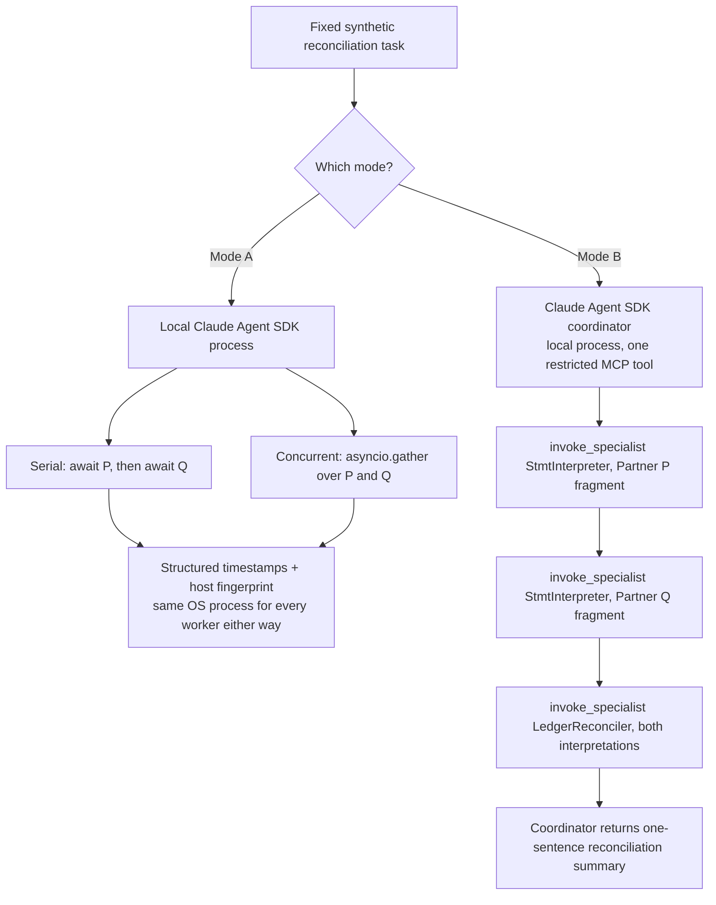

# ClaudeHarnessEvidence — Customer Reproduction Guide

A narrowed, repeatable evidence proof for two modes:

- **Mode A** — Claude Agent SDK alone, run locally, both serially and
  concurrently, over a fixed synthetic partner-reconciliation task.
- **Mode B** — an actual Claude Agent SDK coordinator that invokes two
  separately deployed AgentCore Harness specialists through an authenticated
  invocation adapter.

Deployed and invoked for real against `AWS_PROFILE=ml-sandbox
AWS_REGION=us-east-1`, account `654654616949`. **No VPC/NAT/EIP exists in
this deployment.** Every claim about network egress or network isolation is
explicitly deferred to [Phase 2](#phase-2-vpcnateip-and-a-customer-controlled-collector-not-implemented),
which is unimplemented and clearly separated from everything that was
actually built and run below.

## Fact vs. inference vs. assumption

- **[FACT]** — directly observed: a command actually run, a response
  actually returned, a log line actually fetched, a policy document actually
  read, in this session, against this real deployment.
- **[INFERENCE]** — a conclusion that follows from our own observed facts
  but was not itself independently measured.
- **[ASSUMPTION]** — a claim about the *customer's* environment (e.g. their
  EKS cluster configuration) that this project has not verified at all.
  Every assumption is labeled and must be confirmed with the customer before
  it is relied on for a governance or security claim.

---

## Table of contents

0. [Executive framing: current customer state](#0-executive-framing-current-customer-state)
1. [Business activity diagram](#1-business-activity-diagram)
2. [Local prerequisites](#2-local-prerequisites)
3. [Claim-to-evidence table](#3-claim-to-evidence-table)
4. [Mode A: local Claude Agent SDK control](#4-mode-a-local-claude-agent-sdk-control)
5. [Mode B: Claude Agent SDK coordinator + AgentCore Harness specialists](#5-mode-b-claude-agent-sdk-coordinator--agentcore-harness-specialists)
6. [Deployment evidence and present governance state](#6-deployment-evidence-and-present-governance-state)
7. [IAM policy pattern for the coordinator (practical IaC)](#7-iam-policy-pattern-for-the-coordinator-practical-iac)
8. [Agent Registry reuse — design-only](#8-agent-registry-reuse--design-only)
9. [CloudWatch/CloudTrail trajectory: what is primary evidence](#9-cloudwatchcloudtrail-trajectory-what-is-primary-evidence)
10. [Denied unknown specialist / unsafe input: error evidence](#10-denied-unknown-specialist--unsafe-input-error-evidence)
11. [Exact reproduce commands](#11-exact-reproduce-commands)
12. [True limitations (observed, not assumed)](#12-true-limitations-observed-not-assumed)
13. [Phase 2: VPC/NAT/EIP and a customer-controlled collector (NOT implemented)](#phase-2-vpcnateip-and-a-customer-controlled-collector-not-implemented)

---

## 0. Executive framing: current customer state

**[ASSUMPTION — confirm with the customer before relying on this framing
for any governance or security claim.]** This guide's Mode A demonstration
is written to map onto what we believe is the customer's current
production pattern: **Claude Agent SDK subagents running as local processes
inside a Kubernetes pod on Amazon EKS, typically on Spot-capacity worker
nodes**, with the pod's AWS permissions granted via either **IRSA (IAM
Roles for Service Accounts)** or **EKS Pod Identity** -- which mechanism,
and the exact role/policy actually attached, has **not** been confirmed
with the customer as of this writing.

If that framing is accurate, three consequences follow directly from Mode
A's own measured evidence (§4), not from speculation about EKS in general:

- **Shared pod role, network, filesystem, and secrets.** Every subagent
  process in such a pod would run under the *same* IRSA/Pod-Identity IAM
  role, the *same* pod network namespace, the *same* mounted filesystem,
  and the *same* environment/secrets -- this is exactly the same-host
  sharing Mode A measured directly (`single_shared_pid: true` across every
  worker, serial or concurrent). In a pod, "same OS process" becomes "same
  pod" (possibly several processes, but one network namespace, one set of
  mounted secrets, one IAM identity) -- a different-shaped boundary, but
  the same kind of gap: nothing distinguishes one subagent's blast radius
  from another's.
- **Elevated-permission blast radius.** If that shared pod role carries
  broad permissions -- for example, the kind of wildcard `bedrock:InvokeModel`
  on `foundation-model/*` this project's *own* Harness roles were found to
  carry (§6) -- a single compromised, misconfigured, or successfully
  prompt-injected subagent can exercise *every* permission the pod's role
  holds, not just the permission its specific task needed.
- **Spot interruption risk.** Amazon EC2 Spot capacity (including EKS
  managed and self-managed Spot node groups) can be reclaimed with as
  little as a two-minute warning. A long-running local subagent
  orchestration process with no external checkpoint (as in this guide's
  Mode A) has no built-in resumption if its node is reclaimed mid-task --
  in-flight work is simply lost unless the customer's own orchestration
  layer separately handles the Spot interruption signal.

**Why Mode B matters for this customer, precisely because of the above:**
moving a bounded capability out of the shared pod and into an
independently-configured AgentCore Harness resource (§5) means that
capability no longer shares the pod's role, network namespace, filesystem,
or Spot-interruption fate -- it runs in AgentCore's own managed execution
environment, under its own IAM role. **This guide does not yet claim that
governance boundary is fully realized.** §6 states, without softening,
exactly what is and is not yet in place; §7 proposes the specific next
control.

---

## 1. Business activity diagram



**[FACT]** Both paths were actually run against this deployment; see
[§4](#4-mode-a-local-claude-agent-sdk-control) and
[§5](#5-mode-b-claude-agent-sdk-coordinator--agentcore-harness-specialists)
for the captured output. **Mode B's three calls are drawn strictly in
sequence** (B2 -> B3 -> B4), because that is what was observed -- see §5's
sequencing note; this diagram makes no concurrency claim for Mode B.

### Personas

| Persona | Role |
| --- | --- |
| **Operator** | Runs Mode A/B locally with `AWS_PROFILE=ml-sandbox`, under an individual operator IAM user -- not a scoped role (§6). The specific identity ARN is captured by `mode_a/evidence.py::aws_identity()` at runtime and is deliberately not printed in this customer-facing guide. |
| **Coordinator** | Mode A: nothing beyond the local process. Mode B: a Claude Agent SDK session with `invoke_specialist` as its one *registered* tool -- see §5 for what that does and does not restrict |
| **StmtInterpreter specialist** | AgentCore Harness; extracts invoice ids/amounts from one partner fragment |
| **LedgerReconciler specialist** | AgentCore Harness; compares two interpreted invoice lists and reports matches/mismatches |

---

## 2. Local prerequisites

- Python 3.10+ and `uv` ([install uv](https://docs.astral.sh/uv/getting-started/installation/)).
- Node.js 20.x+ (for the AgentCore CDK stack).
- The `agentcore` CLI (`npm install -g @aws/agentcore` or equivalent).
- The `claude` CLI installed and on `PATH` (`claude --version`) -- the
  `claude-agent-sdk` Python package shells out to it. **[FACT]** confirmed
  present at `2.1.283` for this work.
- AWS credentials for profile `ml-sandbox` with Bedrock model-invoke access
  and AgentCore permissions in `us-east-1`.
- No secret value (access key, session token) is ever printed by any script
  in this project -- only non-secret identity (`Account`, `Arn`) via STS
  `GetCallerIdentity`, and boolean presence checks for
  `AWS_PROFILE`/`AWS_REGION` env vars. This guide itself additionally
  omits the specific operator identity ARN (see Personas above).

---

## 3. Claim-to-evidence table

| Mode | Precise claim | Minimum evidence | This does **not** prove |
| --- | --- | --- | --- |
| **A** | Concurrent, context-isolated Claude Agent SDK subagent calls are real (overlap in wall clock); every worker, serial or concurrent, shares one OS process/filesystem/environment | `evidence/mode_a_run_*.json`: `same_host_evidence.single_shared_pid: true` across all 4 workers; `timing_evidence`: concurrent (9.6s) < serial (20.7s) for the identical task | Any network or IAM boundary -- Mode A deploys nothing to AWS beyond the Bedrock model call itself |
| **B** | A real Claude Agent SDK coordinator, with one specialist tool registered, correctly sequences (one call at a time -- **not a concurrency claim**) two independently deployed Harness specialists and returns only a typed/redacted result | `evidence/mode_b_run_*.json`: 3 real `invoke_specialist` tool calls in the correct order, `result_is_error: false`, a correct final summary; `evidence/denial_evidence.json`: unknown specialists and unsafe inputs rejected before any AWS call | Fixed network egress, a customer-observable source IP, network isolation between the coordinator and the specialists, an exclusive coordinator tool set (§5), or per-specialist-scoped IAM permissions (§6) -- none of that exists in this deployment yet |

---

## 4. Mode A: local Claude Agent SDK control

Source: `mode_a/partner_reconciliation.py`, `mode_a/evidence.py`, `mode_a/run_mode_a.py`.

Fixed synthetic task (`PARTNER_FRAGMENTS`):

```
P: "Synthetic Partner P statement: invoice INV-1001 for $500.00, invoice INV-1002 for $250.00. Total: $750.00."
Q: "Synthetic Partner Q statement: invoice INV-1001 for $500.00, invoice INV-1003 for $125.00. Total: $625.00."
```

Each worker calls `claude_agent_sdk.query()` configured for Bedrock:

```python
ClaudeAgentOptions(
    model="us.anthropic.claude-haiku-4-5-20251001-v1:0",
    env={"CLAUDE_CODE_USE_BEDROCK": "1", "AWS_REGION": "us-east-1"},
    system_prompt=SYSTEM_PROMPT,
    max_turns=1,
)
```

**[FACT]** This inference profile was verified with a direct smoke test
before use (`bedrock-runtime.converse`, response `"PONG"`, `stopReason:
end_turn`) -- see `evidence/` and §6.

### Captured result (`evidence/mode_a_run_1790513013.json`)

| | Serial | Concurrent |
| --- | --- | --- |
| `total_elapsed_ms` | 20,746 | 9,611 |
| Worker P `elapsed_ms` | 9,865 | 9,611 (bounded by the slower worker) |
| Worker Q `elapsed_ms` | 10,881 | 9,554 |

```json
{
  "distinct_pids_observed_across_coordinator_and_all_workers": [88284],
  "single_shared_pid": true
}
{
  "serial_total_elapsed_ms": 20746,
  "concurrent_total_elapsed_ms": 9611,
  "concurrent_faster_than_serial": true
}
```

**What this proves, precisely:** concurrency is real (9.6s vs. 20.7s for
identical work) **and**, independently, every worker in both runs reported
the exact same OS process id (`88284`) -- the coordinator process's own pid.
This is *evidence*, not an assertion: the same-host limitation is
demonstrated by inspecting `os.getpid()` at each worker, not by claiming the
SDK is incapable of concurrency (it isn't -- the timing numbers above are
the proof of the opposite). §0 explains why this same-host result is the
evidentiary basis for the pod-level blast-radius concern in an assumed
EKS deployment.

---

## 5. Mode B: Claude Agent SDK coordinator + AgentCore Harness specialists

Source: `coordinator/run_mode_b.py`, `coordinator/mcp_tool.py`,
`coordinator/adapter.py`, `coordinator/schemas.py`, `coordinator/resources.py`.

The coordinator's `ClaudeAgentOptions`:

```python
ClaudeAgentOptions(
    model="us.anthropic.claude-haiku-4-5-20251001-v1:0",
    env={"CLAUDE_CODE_USE_BEDROCK": "1", "AWS_REGION": "us-east-1"},
    system_prompt=COORDINATOR_SYSTEM_PROMPT,
    mcp_servers={"specialists": build_server()},
    allowed_tools=["mcp__specialists__invoke_specialist"],
    max_turns=8,
)
```

`invoke_specialist` itself refuses any specialist name not in
`coordinator/resources.json`'s allowlist before ever calling AWS (§10).

### Corrected tool claim -- read this before citing this guide for a security claim

**This guide previously stated that `invoke_specialist` was the
coordinator's only capability and that no other tool was available. That
claim was incorrect and is retracted here.**

**[FACT]** The captured Mode B trajectory's first tool call is `ToolSearch`,
not `invoke_specialist` -- see `evidence/mode_b_run_1790513759.json`,
`tool_calls[0]`:

```json
{"tool_name": "ToolSearch", "input": {"max_results": 1, "query": "select:mcp__specialists__invoke_specialist"}}
```

`ToolSearch` is a Claude Code platform-level meta-tool (used here to
resolve/load the requested MCP tool's schema) that ran in this execution
environment despite `allowed_tools` being set to a single-item list.
**`allowed_tools` restricts which *registered* tools the model may invoke;
it did not, in the run actually captured, make the coordinator's full tool
surface exclusively `invoke_specialist`.**

**Restriction caveat and the next control (not yet implemented):** for a
governance-relevant claim of the shape "this coordinator cannot do X," a
single `allowed_tools` list is not sufficient evidence on its own. The next
control -- proposed here, not yet built or verified -- is to run the
coordinator in an execution environment where `ToolSearch` and any other
platform-level meta-tool are themselves unavailable or explicitly denied
(e.g. `disallowed_tools`, a sandboxed runtime with no deferred-tool search
registered, or a permission hook that denies any tool call outside an
exact allowlist at the transport layer), then re-capture the trajectory and
confirm no meta-tool call appears in it.

### Sequencing -- not a concurrency claim

**[FACT]** `run_mode_b.py` contains no `asyncio.gather` and no concurrent
fan-out: the coordinator issues one tool call per model turn, waits for
its result, then issues the next. The captured trajectory's per-call
elapsed timestamps are strictly increasing with no overlap
(`worker_started` at 19,329ms / 25,243ms / 30,045ms / 38,759ms into the
run -- each call starts only after the previous one has already returned).
**Mode B, as run and captured here, makes no concurrency claim.** Unlike
Mode A (§4), nothing in this section demonstrates or asserts overlapped
Harness invocations.

### Captured result (`evidence/mode_b_run_1790513759.json`)

The coordinator, unprompted beyond its system prompt, made exactly 3
specialist tool calls in the correct order, each with a distinct **named
session id**:

| Step | Specialist | Session id |
| --- | --- | --- |
| 1 | `StmtInterpreter` | `interpret_statement_partner_p_session_20260927_001` |
| 2 | `StmtInterpreter` | `interpret_statement_partner_q_session_20260927_002` |
| 3 | `LedgerReconciler` | `reconcile_ledger_session_20260927_003` |

Final coordinator summary (verbatim):

> "The reconciliation is complete: Partner P and Partner Q agree only on
> invoice INV-1001 for $500.00, while INV-1002 ($250.00) appears only in
> Partner P and INV-1003 ($125.00) appears only in Partner Q, indicating
> unmatched discrepancies between the two ledgers."

This is factually correct against the fixed synthetic data:
`result_is_error: false`, `num_turns: 5`, `total_elapsed_ms: 45810`.

### Verified invocation API (the "unclear API" this task anticipated)

**[FACT]** Direct `boto3 bedrock-agentcore.invoke_agent_runtime` against a
harness's *underlying runtime ARN* is explicitly rejected by AWS:

```
ValidationException: The agent runtime ...runtime/harness_ClaudeHarnessEvidence_StmtInterpreter-Kjn7S9CyYC
is managed by a harness and cannot be invoked directly. Use the InvokeHarness API with the
relevant harness ID instead.
```

**[FACT]** `boto3 bedrock-agentcore.invoke_harness(harnessArn=..., runtimeSessionId=...,
messages=[{"role":"user","content":[{"text":...}]}])` against the **harness ARN**
is the real, working, confirmed API -- this is what `coordinator/adapter.py`
uses. Full details, including the confirmed input/output shapes and the
`runtimeSessionId` length constraint (>= 33 characters), are in
`evidence/direct_boto3_api_findings.md`. Nothing in this project calls a
fabricated SDK method; the CLI pathway (`agentcore invoke --harness ... --prompt
... --session-id ...`) was also independently verified and is documented as
a fallback in the same file.

---

## 6. Deployment evidence and present governance state

| Field | `StmtInterpreter` | `LedgerReconciler` |
| --- | --- | --- |
| Harness ARN | `arn:aws:bedrock-agentcore:us-east-1:654654616949:harness/ClaudeHarnessEvidence_StmtInterpreter-Jx8JUA8O1S` | `arn:aws:bedrock-agentcore:us-east-1:654654616949:harness/ClaudeHarnessEvidence_LedgerReconciler-dgn0FdelLz` |
| Underlying Runtime ARN | `arn:aws:bedrock-agentcore:us-east-1:654654616949:runtime/harness_ClaudeHarnessEvidence_StmtInterpreter-Kjn7S9CyYC` | `arn:aws:bedrock-agentcore:us-east-1:654654616949:runtime/harness_ClaudeHarnessEvidence_LedgerReconciler-9VMBuTBpMP` |
| Execution role (distinct ARN) | `arn:aws:iam::654654616949:role/ClaudeHarnessEvidence_StmtInterpreter` | `arn:aws:iam::654654616949:role/ClaudeHarnessEvidence_LedgerReconciler` |
| Status | READY | READY |
| Model | `us.anthropic.claude-haiku-4-5-20251001-v1:0` (bedrock) | `us.anthropic.claude-haiku-4-5-20251001-v1:0` (bedrock) |
| Memory | `disabled` | `disabled` |
| Tools | `[]` | `[]` |
| Network mode | `PUBLIC` (no VPC config) | `PUBLIC` (no VPC config) |
| Authorizer | `AWS_IAM` | `AWS_IAM` |

Stack: `AgentCore-ClaudeHarnessEvidence-sandbox`. Full CDK diff (new stack
only, no resources touched outside this project) captured verbatim in
`evidence/deploy_diff_log.txt`; full stack outputs in `evidence/deploy_outputs.json`.

### Present governance state -- stated honestly, without softening

**[FACT]** Each Harness has its own, distinctly-named IAM role (table
above). **[FACT]** Reading both roles' inline policy documents
(`aws iam get-role-policy`) shows they are **the same CDK-generated default
policy template**, not two independently scoped policies:

- Both grant `bedrock:InvokeModel`/`InvokeModelWithResponseStream` on
  `arn:aws:bedrock:*::foundation-model/*` -- a wildcard across **every**
  foundation model in the account/region, not scoped down to only the one
  model each Harness is actually configured to call
  (`us.anthropic.claude-haiku-4-5-20251001-v1:0`).
- Both grant the same `logs:*`, `xray:*`, `ecr-public:GetAuthorizationToken`,
  and `bedrock-agentcore:GetWorkloadAccessToken*` statements, differing only
  in the resource ARN's own workload-identity path where AWS enforces that
  scoping automatically.

**Distinct roles with an identical, unscoped-model default policy is not
the same governance property as "each specialist's permissions are
independently minimized."** No action was taken in this deployment to
narrow either role's `bedrock:InvokeModel` resource to that Harness's own
configured model; doing so is a straightforward follow-up (a per-Harness
IAM policy override), not yet done.

**[FACT]** Every invocation captured in this guide (Mode B's `InvokeHarness`
calls, the direct boto3 smoke tests, the CLI invocation) ran under the
**operator's own individual IAM user**, not under any scoped coordinator
role. There is currently no distinct, minimally-scoped "coordinator"
identity in this account -- §7 proposes exactly the policy such an identity
should carry.

**Bedrock model smoke test (before wiring into any harness):**

```json
{"role": "assistant", "content": [{"text": "PONG"}]}
stopReason: end_turn
```

`us.anthropic.claude-haiku-4-5-20251001-v1:0` confirmed `ACTIVE` via
`aws bedrock list-inference-profiles` and directly invokable via
`bedrock-runtime.converse` before any harness was configured to use it.

**CloudTrail:** checked twice for `InvokeHarness` events; **0 results**
both times, despite multiple confirmed-successful invocations in between.
Control-plane events (`GetHarness`, `ListTagsForResource` from the CDK
deploy) **did** appear. **There is currently no data-plane invocation trail
for this account/service** -- see §9 for the full finding and what it would
take to add one.

---

## 7. IAM policy pattern for the coordinator (practical IaC)

**[INFERENCE -- proposed pattern, not yet applied to any real identity in
this account.]** Whatever identity actually runs the coordinator -- today,
the operator's own IAM user (§6); in the assumed EKS deployment (§0), an
IRSA-associated role or an EKS Pod Identity association, whichever the
customer's cluster actually uses -- it should carry a policy scoped to
exactly the deployed specialists, and nothing else:

```json
{
  "Version": "2012-10-17",
  "Statement": [
    {
      "Sid": "InvokeNamedHarnessSpecialistsOnly",
      "Effect": "Allow",
      "Action": "bedrock-agentcore:InvokeHarness",
      "Resource": [
        "arn:aws:bedrock-agentcore:us-east-1:654654616949:harness/ClaudeHarnessEvidence_StmtInterpreter-Jx8JUA8O1S",
        "arn:aws:bedrock-agentcore:us-east-1:654654616949:harness/ClaudeHarnessEvidence_LedgerReconciler-dgn0FdelLz"
      ]
    }
  ]
}
```

This is deliberately the same allowlist shape as `coordinator/resources.json`
and `coordinator/adapter.py`'s runtime check (§5, §10) -- IAM as a second,
independent enforcement layer for the same boundary, not a replacement for
the adapter's own check.

**[ASSUMPTION -- confirm which mechanism applies]** For an EKS deployment
per §0, attaching this policy means either:

- **IRSA:** the policy is attached to an IAM role trusted by the cluster's
  OIDC provider, and the coordinator's Kubernetes ServiceAccount is
  annotated with that role's ARN; or
- **EKS Pod Identity:** the policy is attached to an IAM role associated
  with the ServiceAccount via a Pod Identity association (no OIDC trust
  policy required).

Which of the two the customer's cluster uses has not been confirmed.

### Generating the allowlist from stack outputs, not by hand

**[INFERENCE]** Hand-typing the ARNs above (as `coordinator/resources.json`
currently does -- see §5) is exactly the kind of manual step that drifts.
The correct source of truth is the CDK stack's own outputs, already
captured verbatim in `evidence/deploy_outputs.json`:

```bash
# Regenerate coordinator/resources.json and the IAM policy's Resource list
# from the stack's own outputs, rather than by hand:
jq '{specialists: {StmtInterpreter: .outputs.StmtInterpreter.harnessArn,
                    LedgerReconciler: .outputs.LedgerReconciler.harnessArn}}' \
   evidence/deploy_outputs.json
```

### Resource drift warning

**[FACT]** Each harness ARN embeds a CDK-generated random suffix
(`-Jx8JUA8O1S`, `-dgn0FdelLz`) assigned at deploy time. **[INFERENCE]** If a
harness resource is later replaced by CloudFormation (for example, a
property change that forces replacement rather than an in-place update,
per this project's own `AGENTS.md`: "Renaming a resource will destroy and
recreate it"), its ARN's suffix changes. If `coordinator/resources.json`
and the IAM policy above are not regenerated from the fresh stack outputs
at that point, the result is either:

- **Fail closed:** the adapter's allowlist (§5, §10) does not recognize the
  new ARN and rejects every call -- safe, but breaks the coordinator until
  fixed; or
- **A silent over-broad policy**, if a future revision of this pattern were
  to replace the exact-ARN list with a wildcard to avoid exactly this
  problem -- which would defeat the purpose of naming exact resources and
  is explicitly **not** recommended here.

Regenerate both `coordinator/resources.json` and the IAM policy's `Resource`
list from stack outputs as part of every deploy, not as an occasional
manual fixup.

---

## 8. Agent Registry reuse — design-only

**[FACT]** `SearchRegistryRecords` is a real, confirmed operation on the
`bedrock-agentcore` boto3 client (confirmed via service-model introspection
in this account, and already documented as catalog/discovery -- not
orchestration -- in `GovernedHarnessSubagentDesign/DESIGN.md` §9).

**Whether it supports a "reuse" workflow for these specific Harness
definitions -- discovering, versioning, or re-provisioning
`StmtInterpreter`/`LedgerReconciler` via the Registry -- is genuinely
unknown to this project.** `SearchRegistryRecords` was never called against
this deployment; no claim is made here about what it would return, whether
these Harnesses are registered in it at all, or whether any Registry-driven
deployment or reuse path exists for Harnesses specifically. **Verify/support
status: unknown, not verified. Do not cite this guide as evidence that
Agent Registry deployment or reuse was used or tested.**

### What this project actually uses for reuse today

**[FACT]** Two real mechanisms, both already in place, do the reuse job
without touching the Registry:

1. **Git-versioned harness definitions.** `app/StmtInterpreter/harness.json`
   and `app/LedgerReconciler/harness.json` are plain, version-controlled
   config-as-code -- the model, system prompt, tools, memory, network mode,
   and authorizer for each specialist are all in a file a `git diff` can
   show and a `git blame` can attribute. Reusing a specialist definition
   means committing/branching this file, not calling any AWS API.
2. **ARN-scoped IAM policy reuse (§7).** The same policy *pattern* --
   `bedrock-agentcore:InvokeHarness` on an exact, named ARN list -- is
   reusable across any coordinator identity (operator user today; an
   IRSA/Pod-Identity role in the assumed EKS deployment) by regenerating
   its `Resource` list from fresh stack outputs, per §7.

Both are real, verifiable today. The Registry may or may not add value on
top of them; that evaluation is future design work, not something this
guide has done.

---

## 9. CloudWatch/CloudTrail trajectory: what is primary evidence

**The coordinator's own structured run record is the primary per-invocation
evidence for Mode B -- not the Harness's CloudWatch logs.**

**[FACT]** `coordinator/evidence.py::log_event` prints one structured JSON
line per phase (`run_started`, `worker_started`, `run_completed`) to
stdout, captured verbatim for the run in
`evidence/mode_b_run_1790513759.json`. This record carries the `run_id`,
each specialist name, each tool input (including the session id), and
timing -- everything in §5's tables came from this record, not from AWS.

**[FACT]** By contrast, the two Harnesses' own CloudWatch log groups
(`/aws/bedrock-agentcore/runtimes/harness_ClaudeHarnessEvidence_*-DEFAULT`)
contained, across all 3 recently-checked log streams for `StmtInterpreter`,
only 10 identical cold-start lines (IAM role resolution, MCP instrumentor
init, uvicorn startup) and **no per-invocation request or session detail**
-- full content in `evidence/cloudwatch_stmtinterpreter_boot_log.txt`. A
Harness has no custom application code to add structured logging to; this
is a managed-runtime characteristic, not a bug in this project.

**Console evidence:** no AWS console screenshot was captured for this
project (`docs/assets/` is empty; see `docs/assets/README.md` for why). The
closest available console-equivalent evidence, attached here in its place:

- `evidence/deploy_outputs.json` -- the exact ARN/role/status data the
  AgentCore console's Harness resource page would render for each
  specialist.
- `agentcore status --target sandbox --type harness` -- returns the same
  configuration a console visit would show, without a screenshot.

If a real console screenshot is added later, it should be saved under
`docs/assets/` and referenced from this section directly, alongside --
not instead of -- the coordinator's own structured run record above.

**CloudTrail:** `evidence/cloudtrail_findings.md` -- checked twice for
`InvokeHarness`, 0 results both times; control-plane events from the CDK
deploy (`GetHarness`, `ListTagsForResource`) did appear. Consistent with
`InvokeHarness`/`InvokeAgentRuntime` being data-plane operations that the
default CloudTrail management-events trail does not record. **A data-plane
invocation trail does not currently exist for this account/service.**
Reproducing "who invoked what, when" from AWS alone would require
configuring a CloudTrail data-events selector for
`bedrock-agentcore.amazonaws.com` first -- not done here.

---

## 10. Denied unknown specialist / unsafe input: error evidence

All captured verbatim in `evidence/denial_evidence.json`. Every rejection
below happened **before** any AWS call, except the last two, which are
AWS's own denial (defense in depth: this project doesn't rely on IAM alone,
nor does it rely on the adapter's allowlist alone).

| Scenario | Rejected by | Result |
| --- | --- | --- |
| Unknown specialist name, direct adapter call | `adapter.invoke_specialist`'s allowlist check | `status="error"`, `detail="...is not on the allowlist; AWS was never called"` |
| Unknown specialist name, via the MCP tool (as a model would call it) | Same allowlist check, reached through `mcp_tool.invoke_specialist_tool` | Same result, `isError: true` |
| Extra field (`command: "rm -rf /"`) added to an otherwise-valid task | `pydantic.InterpretTask(extra="forbid")` | `ValidationError: Extra inputs are not permitted` |
| Missing required field (`fragment` omitted) | Pydantic required-field validation | `ValidationError: Field required` |
| Malformed/nonexistent harness ARN, direct `invoke_harness` call | AWS itself | `ValidationException: Invalid harness ARN format.` |
| `invoke_agent_runtime` against a harness-backed runtime ARN | AWS itself | `ValidationException: ...managed by a harness...use the InvokeHarness API` |

---

## 11. Exact reproduce commands

```bash
# --- Mode A ---
cd ClaudeHarnessEvidence/mode_a
uv sync
AWS_PROFILE=ml-sandbox AWS_REGION=us-east-1 uv run python run_mode_a.py

# Mode A tests (fast, no real Bedrock call -- controlled async stub, same technique as
# ParallelPatternsDemo/tests/test_timing.py)
uv run pytest ../tests/test_mode_a.py -v

# --- AgentCore Harness project (Mode B specialists) ---
cd ../agentcore/cdk && npm install && cd ..
AWS_PROFILE=ml-sandbox AWS_REGION=us-east-1 agentcore validate
AWS_PROFILE=ml-sandbox AWS_REGION=us-east-1 agentcore deploy --target sandbox --diff
AWS_PROFILE=ml-sandbox AWS_REGION=us-east-1 agentcore deploy --target sandbox --yes

# Verify a harness via the CLI invocation pathway
AWS_PROFILE=ml-sandbox AWS_REGION=us-east-1 agentcore invoke --harness StmtInterpreter --target sandbox \
  --prompt "Synthetic Partner P statement: invoice INV-1001 for \$500.00, invoice INV-1002 for \$250.00. Total: \$750.00." \
  --session-id "smoke-test-cli-session-0000000000001"

# --- Mode B coordinator ---
cd ../coordinator
uv sync
# Regenerate resources.json from stack outputs (§7) rather than editing it by hand.
AWS_PROFILE=ml-sandbox AWS_REGION=us-east-1 uv run python run_mode_b.py

# Coordinator/adapter tests (mocked boto3 client -- no real AWS call)
uv run pytest ../tests/test_coordinator.py -v

# --- Direct boto3 smoke test of the Bedrock inference profile (run before wiring any harness) ---
AWS_PROFILE=ml-sandbox AWS_REGION=us-east-1 python3 -c "
import boto3
client = boto3.client('bedrock-runtime', region_name='us-east-1')
resp = client.converse(
    modelId='us.anthropic.claude-haiku-4-5-20251001-v1:0',
    messages=[{'role': 'user', 'content': [{'text': 'Reply with exactly the word: PONG'}]}],
    inferenceConfig={'maxTokens': 16},
)
print(resp['output']['message'])
"

# --- IAM governance check (§6) ---
AWS_PROFILE=ml-sandbox aws iam get-role-policy --role-name ClaudeHarnessEvidence_StmtInterpreter \
  --policy-name ApplicationHarnessStmtInterpreterRoleExecutionRoleDefaultPolicyDBAF86D2

# --- CloudWatch / CloudTrail evidence (read-only) ---
AWS_PROFILE=ml-sandbox aws logs describe-log-streams --region us-east-1 \
  --log-group-name "/aws/bedrock-agentcore/runtimes/harness_ClaudeHarnessEvidence_StmtInterpreter-Kjn7S9CyYC-DEFAULT" \
  --order-by LastEventTime --descending --max-items 3

AWS_PROFILE=ml-sandbox aws cloudtrail lookup-events --region us-east-1 \
  --lookup-attributes AttributeKey=EventName,AttributeValue=InvokeHarness --max-results 10
```

**Note on `agentcore package`:** it packages `runtimes[]` entries only. This
project declares zero `runtimes[]` (only `harnesses[]`), so
`agentcore package --runtime StmtInterpreter` correctly errors
("Agent 'StmtInterpreter' not found") -- there is no local build/zip step
for a Harness; it is deployed declaratively by the CDK stack directly. This
is documented here rather than worked around.

---

## 12. True limitations (observed, not assumed)

- **CloudWatch logs for a Harness show boot activity, not per-invocation
  detail.** See §9 -- the coordinator's own structured run record, not
  CloudWatch, is the primary per-invocation evidence for Mode B.
- **CloudTrail did not show `InvokeHarness` events**, checked twice,
  despite confirmed-successful invocations in between. See §9 for the full
  finding and the data-events-trail explanation.
- **`allowed_tools` did not make the coordinator's tool set exclusive** in
  the captured run -- a `ToolSearch` meta-tool call appeared. See §5's
  corrected tool claim and proposed next control.
- **Distinct Harness IAM roles currently share one unscoped default
  policy** (wildcard `bedrock:InvokeModel` on `foundation-model/*` for
  both). See §6's governance state and §7's proposed scoped policy pattern.
- **The coordinator ran as an individual operator IAM user, not a scoped
  role**, in every invocation captured here. See §6 and §7.
- **Harness names are constrained to `40 - len(projectName) - 1`
  characters** (CloudFormation `HarnessName` physical-name limit is 40; the
  physical name is `${projectName}_${harnessName}`). The original name
  `PartnerStatementInterpreter` (27 chars) failed CDK synth under this
  21-character project name and had to be shortened to `StmtInterpreter`
  (15 chars). Plan harness names accordingly under a given project name.
- **`runtimeSessionId` (both the CLI's `--session-id` and boto3's
  `runtimeSessionId`) must be >= 33 characters** -- confirmed by a
  `ValidationException` at 32 characters. A short, human-readable session
  name like `"run-1"` will not work; this guide's named sessions are
  deliberately long enough (`interpret_statement_partner_p_session_20260927_001`,
  55 chars).
- **This deployment has no VPC, NAT Gateway, or Elastic IP.** Every
  specialist is `networkMode: PUBLIC`. No claim about fixed egress IP,
  network isolation, or an observable source IP is made anywhere in this
  document. See §13.
- **Mode B's coordinator ran locally**, not as an AgentCore-deployed
  resource itself (that would be "Mode C" in the broader design work in
  `GovernedHarnessSubagentDesign/`, explicitly out of scope for this task).
- **Whether Agent Registry supports any reuse workflow for these Harnesses
  is unverified.** See §8 -- do not cite this project as Registry evidence.
- **§0's EKS/IRSA/Pod-Identity framing is an unconfirmed assumption**, not
  a fact about the customer's actual environment.

---

## Phase 2: VPC/NAT/EIP and a customer-controlled collector (NOT implemented)

**Nothing in this section was built, deployed, or tested.** It exists so a
reader does not mistake the absence of a claim for an oversight, and so a
future implementer has exact prerequisites rather than a vague TODO.

To add a fixed-egress-IP, network-isolated connector on top of the resources
in this guide (following the architecture already designed in
`../GovernedHarnessSubagentDesign/DESIGN.md`), in order:

1. **Provision VPC networking first, independent of AgentCore:** a private
   subnet, a NAT Gateway with exactly one associated Elastic IP, a route
   table sending that subnet's outbound traffic through the NAT Gateway, an
   Internet Gateway, and VPC interface endpoints for `bedrock-runtime` and
   `logs` (so ordinary model/log traffic does not also exit through the
   fixed IP). None of this is an `agentcore` command; it is the customer's
   own IaC (CDK/Terraform/console).
2. **Deploy a purpose-built BYO AgentCore Runtime connector** (not a
   Harness -- see `GovernedHarnessSubagentDesign/DESIGN.md` §4 for why) into
   that private subnet via `--network-mode VPC --subnets ... --security-groups ...`,
   with deterministic, fixed-configuration HTTP code as its entire
   application.
3. **Stand up a customer-controlled test collector** -- ideally on the
   partner's own side, or at minimum a collector this account does not
   solely control -- that logs the source IP of inbound connections. Without
   this, **no claim about an observed source IP can be made**, per
   `GovernedHarnessSubagentDesign/DESIGN.md` §9's last warning, which this
   guide reaffirms rather than repeats.
4. Only after (1)-(3) are real: extend the claim-to-evidence table in §3
   with a "Phase 2" row, and only then reference an EIP, a route table, or
   a Flow Log as evidence -- each with the same "can prove / cannot prove"
   discipline as `GovernedHarnessSubagentDesign/DESIGN.md` §7.

This project is authorized only for the Mode A/B sandbox resources actually
deployed above; Phase 2 infrastructure was explicitly out of scope and
correctly not created.
